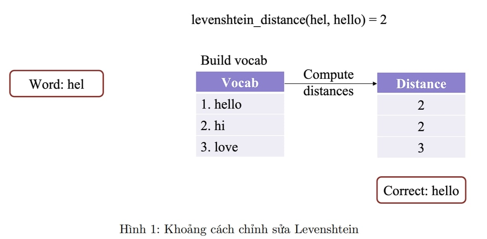
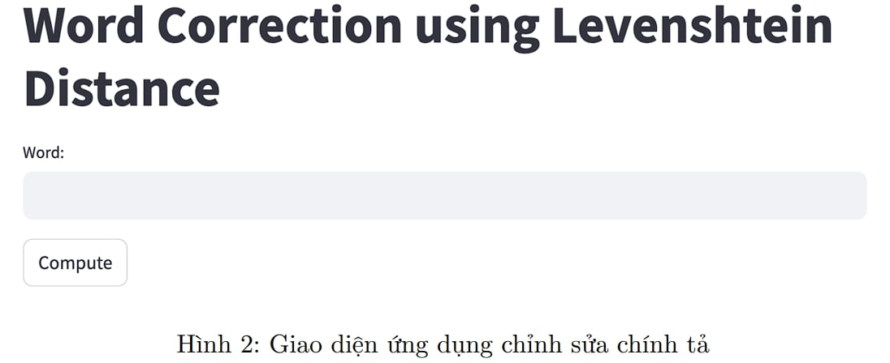
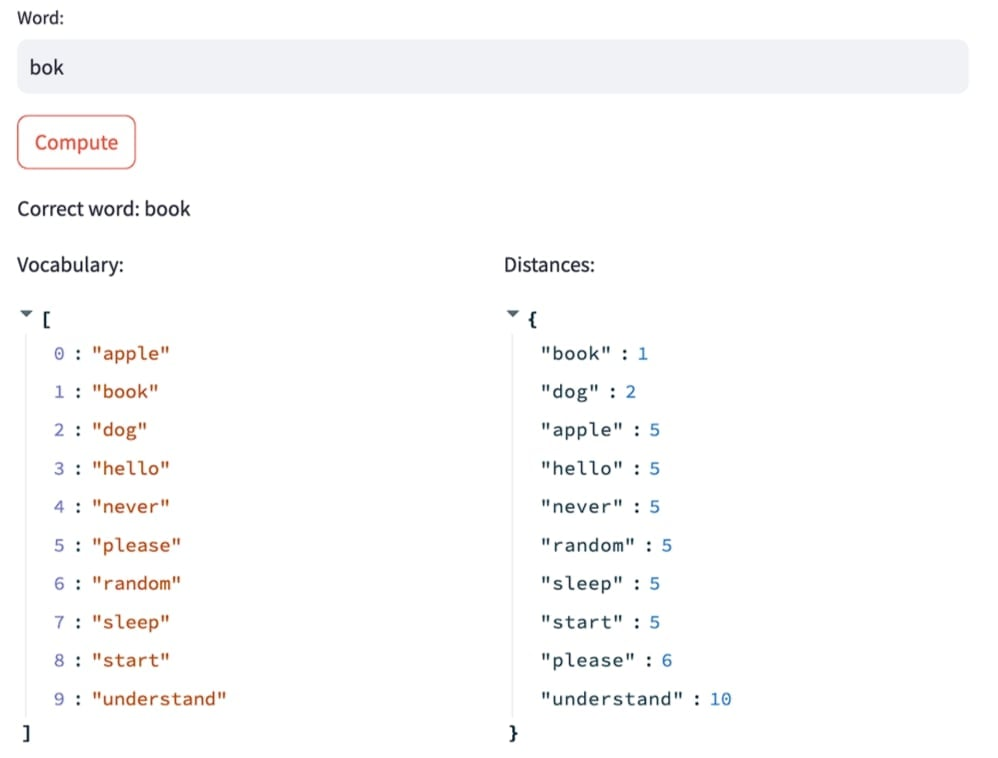
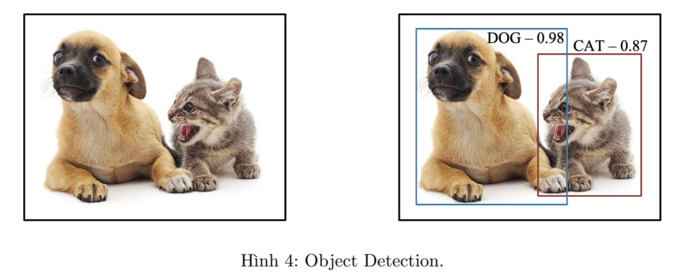
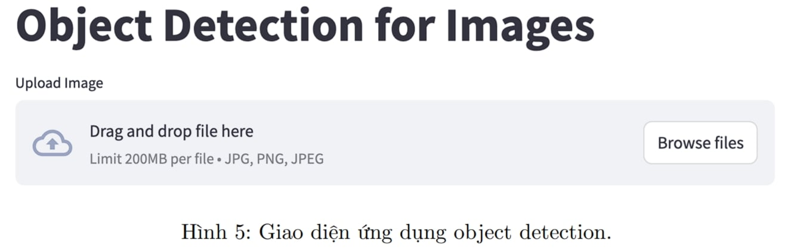
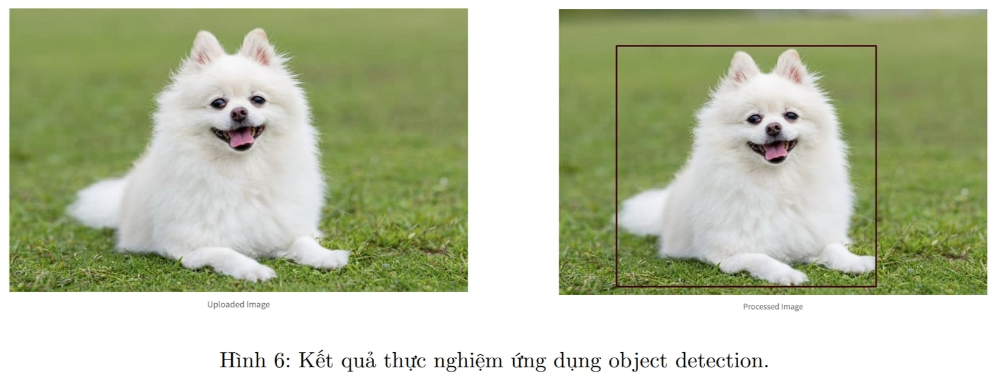
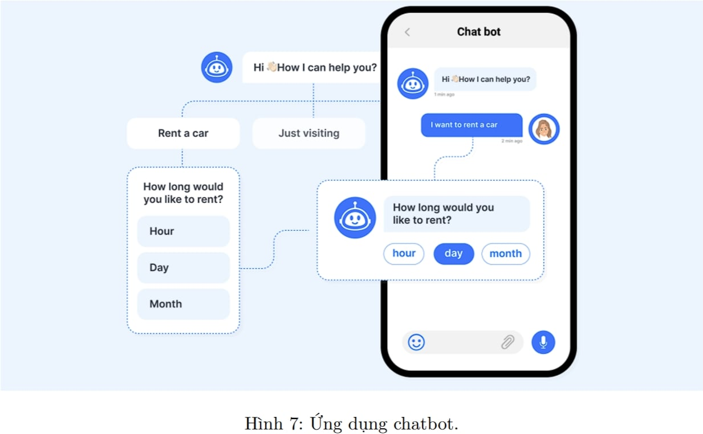
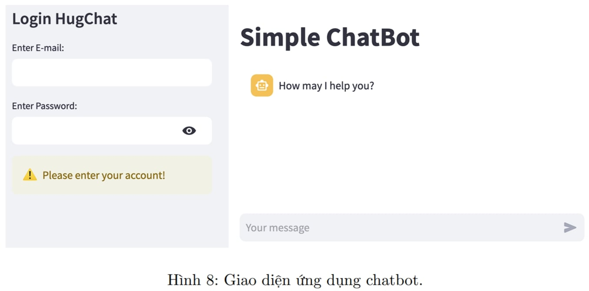
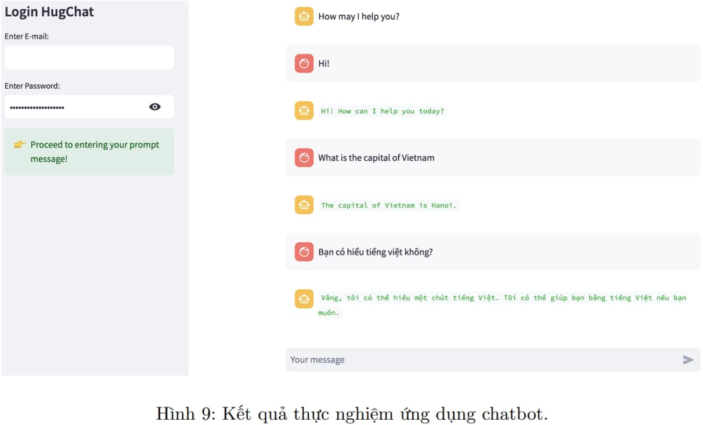

# Deploy-applications-using-Streamlit
Deploy some basic applications (Word Correction, Object Detection, Chatbot) using Streamlit

Xây dựng và phát triển các ứng dụng AI bao gồm các bước sau:
- Data Handling: bao gồm các bước về thu thập và xử lý dữ liệu
- Exploratory Data Analysis (EDA): phân tích các đặc trưng của dữ liệu
- Modeling: từ các đặc trưng, xây dựng các mô hình và đánh giá tính hiệu quả của mô hình
- Deployment: triển khai mô hình thành sản phẩm trên các nên tảng khác nhau như website, app,...

Trong phần này, chúng ta sẽ tập trung tìm hiểu thư viện Streamlit, một trong những thư viện mã
nguồn mở được phát triển và ứng dụng rộng rãi để triển khai các ứng dụng AI nói chung. Streamlit
cung cấp các công cụ hiệu quả để tương tác với người dùng để nhập thông tin hoặc hiển thị thông tin.
Trong các phần tiếp theo, chúng ta tập trung vào phát triển các ứng dụng cơ bản sau:
- Word Correction
- Object Detection
- Chatbot

*Lưu ý:*
Ta sẽ cần cài các thư viện cần thiết thông qua các lệnh sau:
- Thư viện streamlit: pip install streamlit
- Thư viên cv2: pip install opencv-python

## 1. Word Correction:

Word Correction (Sửa lỗi chính tả) là một trong những ứng dụng cơ bản của xử lý ngôn ngữ tự
nhiên, với mục đích xây dựng các ứng dụng nhận đầu vào là một từ, thông qua mô hình sửa lỗi
nếu từ đó bị sai thành một từ đúng.

Ví dụ: người dùng nhập vào từ ’hel’ là một từ sai, mô hình sẽ gợi ý sửa lỗi thành từ ’hello’. Để
đơn giản trong phần này, chúng ta sẽ sử dụng độ đo khoảng cách chỉnh sửa tối thiểu giữa hai từ,
là độ đo levenshtein.

Để giải quyết bài toán này, chúng ta thực hiện các bước sau để xây dựng thuật toán:
- Đầu tiên chúng ta sẽ xây dựng bộ từ điển (gọi là dictionary hoặc vocabulary). Một số từ
vựng được chuẩn bị sẵn trong file vocab.txt.
- Tương ứng với mỗi từ trong từ điển, chúng ta tính khoảng cách levenshtein với từ đã có được
nhập vào bởi người dùng.

Tiếp theo, chúng ta sẽ xây dựng giao diện bằng thư viện streamlit. Giao diện của ứng dụng được
mô tả như hình sau:

Cuối cùng, tất cả code sẽ được để trong file levenshtein_distance.py. Sau đó, chúng ta chạy lệnh
"streamlit run levenshtein_distance.py" và thực hiệm được kết quả như hình sau:

## 2. Object Detection:
Object Detection là ứng dụng quan trọng điển hình của xử lý hình ảnh, với mục tiêu phát hiện
các khung hình chứa các đối tượng trong ảnh. Ví dụ minh hoạ về ứng dụng như hình sau:

Trong phần này chúng ta sẽ xây dựng ứng dụng cho người dùng tải lên ảnh đầu vào, sử dụng mô
hình DNN từ thư viện opencv (Vì phần project này tập trung vào thư viện streamlit vì vậy nên
chúng ta sẽ không đi sâu vào mô hình DNN của thư viện opencv). Chúng ta xây dựng 2 hàm: 1
hàm để đẩy ảnh đầu vào vào mô hình DNN để tìm được các bounding box phù hợp và 1 hàm để
lọc những bounding box có độ tin cậy thấp và trả về kết quả là các vị trí toạ độ của bounding
box đó. Các cài đặt cho mô hình được thiết lập trong 2 file model và prototxt trong thư mục model.

Giao diện ứng dụng được mô tả như hình sau:

Sau đó, tất cả code sẽ được để trong file: ’object_detection.py’. Cuối cùng chúng ta chạy lệnh
’streamlit run object_detection.py’ để thử nghiệm và thu được kết quả như sau:

## 3. Chatbot
Chatbot là ứng dụng được chú ý phát triển mạnh những năm gần đây, các ứng dụng chatbot chủ
yếu tập trung vào các mô hình ngôn ngữ lớn có thể tương tác tốt với các yêu cầu của người dùng.
Ví dụ về chatbot được mô tả trong hình sau:

Trong phần này, chúng ta xây dựng ứng dụng chatbot đơn giản dựa trên thư viện hugchat và
streamlit. Đầu tiên chúng ta cần có tài khoảng hugging face để có quyền truy cập hugchat. Sau
đó truy cập vào trang sau đây để gửi yêu cầu truy cập hugchat.
Sau khi được chấp nhận quyền truy cập, chúng ta xây dựng giao diện ứng dụng được mô tả như
sau:

Giao diện có bố cục gồm 2 phần:
- Phần bên trái: Chứa thông tin nhập vào tài khoản và mật khẩu huggingface, được sử dụng
để có quyền truy cập vào hugchat.
- Phần bên phải (phần trung tâm): Chứa khu vực nhập vào văn bản và trả về phản hồi từ
chatbot.

Sau khi hoàn thiện code vào file ’chatbot.py’, chúng ta chạy lệnh: ’streamlit run chatbot.py’ và
thử nghiệm thu được kết quả như sau:

